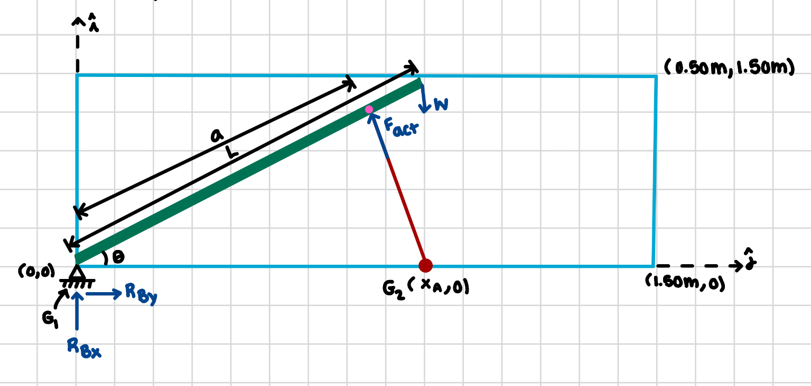

# Single-Link Lifting Mechanism — Portfolio Entry

> **Project goal:** design a 2D lifting mechanism (inside a 150 cm × 50 cm envelope) that reaches the highest tip height (50.0 cm), and for that height maximize static lift using the actuator's peak thrust.

---

## Objective
The assignment mixes two goals:

> “…lift the maximum possible weight to the highest possible height.”

I interpret this as the following objectives:

- **Primary:** Reach the maximum allowable tip height within the 50.0 cm vertical envelope.  
- **Secondary:** For that configuration, maximize the static weight that can be lifted/held using the actuator’s **peak** thrust.

## Mechanism choice (2D single-bar linkage)

- **Pivot (Pin 1):** \(G_1=(0,0)\) (ground).  
- **Actuator ground pin (Pin 2):** \(G_2=(0.90,0)\).  
- **Actuator-to-bar pin (Pin 3):** point \(P\) at distance \(a\) from the pivot along the bar.  
- **Bar (boom):** rigid length \(L\).  
- **Load:** vertical point load \(W\) at the bar tip.

---

## Design parameters (initial case)

| Parameter | Symbol | Value |
|---|---:|:---|
| Envelope | — | 150 cm × 50 cm |
| Bar length | \(L\) | 1.00 m |
| Tip height target | \(y_{\text{tip}}\) | 0.50 m |
| Actuator peak thrust | \(F_a\) | 35.81 kN = 35,810 N (IMA55 RNO5) |
| Max actuator stroke | — | 457 mm |
| Actuator base | \(G_2\) | (0.90 m, 0) |
| Actuator attach point | \(a\) | 0.85 m |

---

## Geometry at top position (tip = 0.50 m)

Bar angle:
\[
L\sin\theta = 0.50 \Rightarrow \theta = \arcsin(0.50/1.00) = 30^\circ
\]

Coordinates:
- Tip = \((L\cos\theta,\,L\sin\theta) = (0.866,\,0.500)\,\text{m}\)  
- \(P = (a\cos\theta,\,a\sin\theta) = (0.737,\,0.425)\,\text{m}\)

Actuator length:
\[
|G_2P| = \sqrt{(0.90 - 0.737)^2 + (0 - 0.425)^2} \approx 0.456\ \text{m} = 456\ \text{mm}
\]
This checks out because it is within the max stroke of 472.2 mm. 

---

## Statics — max weight at top position

Moment balance about pivot:
\[
W(L\cos\theta) = F_a d_\perp
\quad\Rightarrow\quad
W = \frac{F_a d_\perp}{L\cos\theta}
\]

\(d_\perp\) is perpendicular distance from pivot to actuator line. Compute with the 2-D cross product:

\[
d_\perp = \frac{|x_A y_B - x_B y_A|}{\sqrt{(x_B-x_A)^2 + (y_B - y_A)^2}}
\]

For \(A=(0.90,0)\), \(B=(0.737,0.425)\):
\[
d_\perp \approx 0.841\ \text{m}
\]

Then:
\[
W = \frac{35\,810 \times 0.841}{1.00 \cos 30^\circ} \approx 34{,}762\ \text{N}
\]
\[
m = \frac{W}{g} \approx \frac{34{,}762}{9.81} \approx 3{,}544\ \text{kg}
\]

---

## Additional case & parameter sweep (illustrates trends)

We also examine a second, balanced case \(L=1.20\ \text{m}\) with \(G_2=(1.00,0)\), \(a=1.00\) and vary \(G_2,a\) by ±0.20 m to show trends:

| Case | L (m) | G₂ (m) | a (m) | Stroke (mm) | d⊥ (m) | W (N) | m (kg) | Feasible? |
|---:|:---:|:---:|:---:|:---:|:---:|:---:|:---:|:---:|
| 1 | 1.00 | 0.90 | 0.85 | 456 | 0.84 | 34,760 | 3,544 | within limit |
| 2 | **1.20** | **1.00** | **1.00** | **420** | **0.97** | **31,630** | **3,224** | within limit|
| 3 | 1.20 | 0.80 | 1.00 | 398 | 0.88 | 28,600 | 2,917 | within limit |
| 4 | 1.20 | 1.20 | 1.00 | 458 | 1.01 | 32,800 | 3,345 |  over limit |
| 5 | 1.20 | 1.00 | 0.80 | 374 | 0.81 | 26,300 | 2,682 | within limit |
| 6 | 1.20 | 1.00 | 1.20 | 465 | 1.04 | 33,800 | 3,446 |  over limit |

---

## Conclusions (short)
- Both \(L=1.00\) m and \(L=1.20\) m designs can meet stroke and envelope limits; the 1.20 m bar increases reach while slightly reducing capacity.  
- Increasing \(G_2\) increases leverage and \(W\), but risks exceeding stroke.  
- Decreasing \(a\) increases mechanical advantage but reduces vertical range.  
- **Balanced recommendation:** \(L=1.20\ \text{m},\ G_2=(1.00,0),\ a=1.00\) — feasible and clear reasoning.

---

## Free-Body Diagram

*(Replace `fbd.png` with your image file. Keep image name exactly `fbd.png`.)*

---

### Notes / practical considerations
- Numbers above use **peak thrust**. For sustained designs use continuous thrust (~12.23 kN) and safety factors.  
- A brake or lock is required to prevent back-drive in vertical applications (Tolomatic note).  

